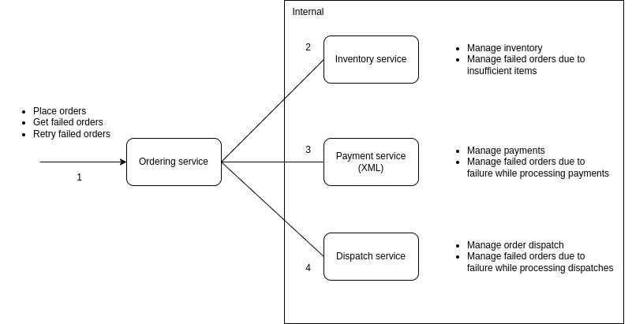

# ballerina-inventory-system

An inventory management sample system built using [Ballerina](https://ballerina.io) to demonstrate the orchestration capabilities of [Choreo.dev](https://wso2.com/choreo).



## Services

The services included in the sub folders of this repo can be directly used to deploy, test observe and manage an inventory managment

1.  Ordering service: To place orders, check at which stage the failed orders are in and retry the failed orders
2.  Inventory service: To manage inventory items and manage failed orders due to insufficient items.
3.  Payment service: To manage payments and manage failed orders due to failure while processing payments
4.  Dispatch service: To manage order dispatch and manage failed orders due to failure while processing dispatches

## Run locally

Run the following command inside each of the four service folders

```
bal run
```

Find out more about Ballerina on [https://ballerina.io](https://ballerina.io)

## Known issues

- Any errors from sub service will be considered as order accepted

## Future work

- Use SOAP for one of the inter service communication
- Store data in an actual data store instead of in memory tables
- Introduce a message orriented comunication for inter service communication
